# ExoBoost (EdgeBoost) - Architecture & System Design Document

## 1. System Vision & Objective
**ExoBoost** is a high-performance, battery-efficient, Xiaomi/MIUI-style universal Edge Toolbox for Android (Targeting Android 13 / API 33+). It operates as an unobtrusive, customizable floating edge handle that unfolds into a glass-morphic quick-tools panel over any application without requiring root, system hacks, or hidden APIs.

---

## 2. Core Architectural Principles
1. **Zero-Poll Idling**: When the edge handle, black screen overlay, or audio/style tools are idle, the application consumes zero CPU cycles.
2. **Strict Public Android API Adherence**: No hidden reflection (`@hide`), no Shizuku, no Xposed, no root execution, no OEM-private API calls.
3. **Fully Dynamic & Customizable Toolbox**: The toolbox panel is never hard-coded. It dynamically renders any subset and order of 12 registered tool actions across customizable layout modes:
   - **4-Column Grid** (Default 4x2 / 4x3)
   - **3-Column Grid** (Spacious 3x3 / 3x4)
   - **2-Column Grid** (Vertical compact 2x4)
   - **Compact Strip** (Horizontal floating scroll strip)
4. **Per-App Profile Customization**: Users can configure distinct tool configurations, default styles, and volume levels for specific apps (e.g. YouTube, Spotify, VLC, Games, WhatsApp).
5. **Honest Capability Detection & Technical Realities**:
   - **UsageStats Foreground Detection**: Relies on standard Android `UsageEvents` (Usage Access). If permission is not granted, ExoBoost falls back to global preferences.
   - **Style Engine**: GPU-accelerated color grading engine processing internal media and live PIP streams.
   - **Volume Boost (100%–300%)**: Represents requested amplification gain (0.0 dB to +9.5 dB) on session 0, with limiter protection.
   - **Black Screen Mode**: Pure `#000000` overlay with display dimming (`screenBrightness = 0.01f`).
6. **Clean Non-Intrusive Capture**: Hides the toolbox and edge handle prior to screenshot acquisition.
7. **Scoped Storage Scrutiny**: All screenshots are saved to public `Pictures/Screenshots` via `MediaStore.Images.Media`.

---

## 3. Layered Architecture

```mermaid
graph TD
    subgraph UI_Layer [UI Layer - Jetpack Compose & Overlay Views]
        MainActivity[MainActivity - Setup, Toolbox Editor, Apps & Settings]
        ToolboxEditor[ToolboxEditorScreen - Active & Available Tools Reordering]
        AppsScreen[AppsManagementScreen - Search, Filter & Profile Editor]
        EdgeHandle[EdgeHandleView - Low-overhead Touch Target]
        FloatingToolboxView[FloatingToolboxView - Dynamic Multi-Layout Tool Grid Panel]
        ConfirmationOverlay[ScreenshotConfirmationOverlay - Thumbnail & Action Card]
        BlackScreenView[BlackScreenOverlayController - Fullscreen #000000 Opaque Surface]
        VolumeBoostCard[VolumeBoostDialog - 100%-300% Floating Card]
        StyleDialog[StyleDialog - 2-Column GPU Preset Grid]
        LiveStyleOverlay[LiveStylePreviewOverlay - Live Filter PIP Card]
    end

    subgraph Service_Layer [Service & Foreground Lifecycle]
        OverlayService[OverlayService - Foreground Service WindowManager Host]
        ScreenshotActivity[ScreenshotCaptureActivity - Translucent Consent & Execution Host]
        LiveStyleActivity[LiveStyleCaptureActivity - Translucent MediaProjection Consent Host]
    end

    subgraph Tool_Engines [Phase 3 to 9 Tool Engines]
        CaptureEngine[ScreenCaptureEngine - ImageReader & VirtualDisplay Buffer]
        MediaSaver[MediaStoreScreenshotSaver - Scoped Storage & MediaStore URI]
        BlackScreenEngine[BlackScreenOverlayController - Gestures, Inset Handling & Dimming]
        AudioDetector[AudioEffectCapabilityDetector - Session 0 & DSP Probe]
        VolumeController[VolumeBoostController - DynamicsProcessing & LoudnessEnhancer]
        StyleEngine[StyleEngine - Preset Manager & Sample Previews]
        ShaderProcessor[ShaderProcessor - GLSL Fragment Shaders & ColorMatrix Filters]
        LiveStreamEngine[LiveStreamCaptureEngine - Downscaled Buffer & Frame Dropping]
        AppDetector[ForegroundAppDetector - UsageStats Top Package Detection]
    end

    subgraph Platform_Data_Layer [Platform Capabilities & Data]
        PreferencesManager[DataStore Preferences - Active Tools Order, Layout & Audio Configs]
        AppProfileManager[AppProfileManager - Per-App Profiles JSON DataStore]
        ToolRegistry[ToolRegistry - 12 ToolAction Dynamic Registry]
    end

    EdgeHandle --> OverlayService
    FloatingToolboxView --> OverlayService
    OverlayService --> ScreenshotActivity
    OverlayService --> LiveStyleActivity
    OverlayService --> BlackScreenEngine
    OverlayService --> VolumeController
    OverlayService --> StyleEngine
    OverlayService --> LiveStreamEngine
    OverlayService --> AppDetector
    OverlayService --> AppProfileManager
    LiveStreamEngine --> LiveStyleOverlay
    StyleEngine --> StyleDialog
    VolumeController --> VolumeBoostCard
    AudioDetector --> VolumeController
    BlackScreenEngine --> BlackScreenView
    ScreenshotActivity --> CaptureEngine
    CaptureEngine --> MediaSaver
    MediaSaver --> OverlayService
    OverlayService --> ConfirmationOverlay
    FloatingToolboxView --> ToolRegistry
    MainActivity --> PreferencesManager
    MainActivity --> AppProfileManager
    MainActivity --> ToolboxEditor
    MainActivity --> AppsScreen
```

---

## 4. Phase 9: 12 Configurable Tool Actions in ToolRegistry

| Tool ID | Action Name | Category / Action | Icon | Default State |
| :--- | :--- | :--- | :--- | :--- |
| `ID_SCREENSHOT` | Screenshot | MediaProjection clean frame capture | CameraAlt | **Active (Order 0)** |
| `ID_RECORD` | Record | Screen recorder pipeline | Videocam | **Active (Order 1)** |
| `ID_SCREEN_OFF` | Screen Off | Fullscreen `#000000` audio listening | Bedtime | **Active (Order 2)** |
| `ID_VOLUME_BOOST` | Volume Boost | Audio session 0 dynamics limiter | VolumeUp | **Active (Order 3)** |
| `ID_STYLE` | Style | GPU shader color grading | Palette | **Active (Order 4)** |
| `ID_AUDIO` | Audio | Audio equalizer & clarity | GraphicEq | **Active (Order 5)** |
| `ID_BRIGHTNESS` | Brightness | Display brightness quick control | Brightness6 | **Active (Order 6)** |
| `ID_VOLUME` | Volume | Media volume slider control | VolumeDown | Available |
| `ID_ORIENTATION` | Orientation | Orientation lock / auto-rotate toggle | ScreenRotation | Available |
| `ID_CAST` | Cast | Wireless projection settings | Cast | Available |
| `ID_TIMER` | Timer | Playback sleep timer overlay | Timer | Available |
| `ID_SETTINGS` | Settings | Open ExoBoost Configuration Hub | Settings | **Active (Order 7)** |
